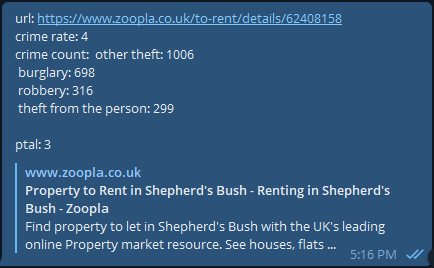

# Frenter

Frenter is a friend who will help you to rent. 

I'm moving to London, so I decided to create a small scrapper to make by flat search for rent a bit convenient. 

Pipeline: 
1. Check for new listings every n seconds
2. Filter them by price, amount of beds, zone
3. Map crime rate and other metadata  by zip code
4. Send a report with the url to the messenger

Sample bot response: 



# Quick start

For now start is a bit tricky, I created it mostly for myself, so you'll 
need to perform some dev-like actions. 

### Step 1 download postcodes dataset

The first thing to do - download [London postcodes dataset](https://data.london.gov.uk/download/postcode-directory-for-london/62b22f3f-25c5-4dd0-a9eb-06e2d8681ef1/london_postcodes-ons-postcodes-directory-feb22.csv) 
from this url to data folder.A

### Step 2 Create telegram bot

Go to [@BotFather](https://t.me/BotFather) in telegram and follow its instructions. 

You'll get a `TELEGRAM_BOT_TOKEN` which is required to start this app.

### Step 3 Get your chat id 

1. type `/start` to your bot
   

2. Type any text to it
   

3. Evaluate this code in jupyter notebook: 
    ```python
   import requrests
   TOKEN = "<YOUR TOKEN>"
   response = requests.get(f"https://api.telegram.org/bot{TOKEN}/getUpdates")
   
    ```
   You'll get something like that: 
    ```
    {'ok': True,
     'result': [{'update_id': <some number>,
       'message': {'message_id': 2,
        'from': {'id': <this is the value you need>,
         'is_bot': False,
         'first_name': '<first name>',
         'last_name': '<last name>',
         'username': '<username>',
         'language_code': 'en'},
        'chat': {'id': <this is the value you need>,
         'first_name': '<first name>',
         'last_name': '<last name>',
         'username': '<username>',
         'type': 'private'},
        'date': <date>,
        'text': 'd'}}]}
     ```
   You need `response['chat']['id']` value, this is your `TELEGRAM_CHAT_ID`
   

4. Create `.env` file with following content
    ```
    TELEGRAM_BOT_TOKEN = '<your bot token>'
    TELEGRAM_CHAT_ID = <your chat id>
    ```

5. Change search parameters if you want in `main.py`


6. Start script with `python main.py` command